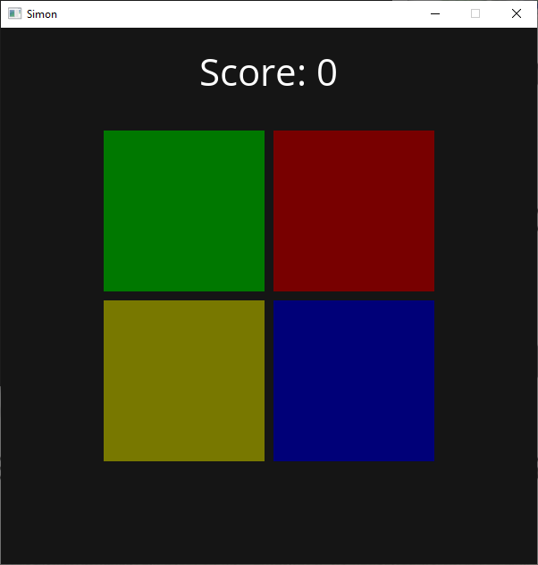

# Simon

Simon is a memorization game with colored buttons. This game is made with C++ and [Wase Engine](https://github.com/Wase-Engine/wase-engine)




## Setting up Simon

Requirements:

 - CMake
 - [Wase Engine](https://github.com/Wase-Engine/wase-engine)
 - SDL2
 - SDL2 image
 - SDL2 mixer
 - SDL2 ttf
 - C++17 or higher


**CMake**
```
git clone https://github.com/JelleVos1/simon.git
cd simon
git clone https://github.com/Wase-Engine/wase-engine.git
mkdir build
cd build
cmake ..
cmake build .
```
